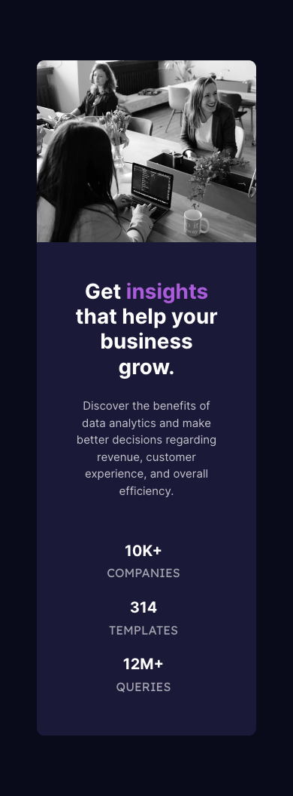

# Frontend Mentor - Stats preview card component solution

This is a solution to the [Stats preview card component challenge on Frontend Mentor](https://www.frontendmentor.io/challenges/stats-preview-card-component-8JqbgoU62). Frontend Mentor challenges help you improve your coding skills by building realistic projects.

## Table of contents

- [Overview](#overview)
  - [The challenge](#the-challenge)
  - [Screenshot](#screenshot)
  - [Links](#links)
- [My process](#my-process)
  - [Built with](#built-with)
  - [What I learned](#what-i-learned)
- [Author](#author)
- [Acknowledgments](#acknowledgments)

## Overview

### The challenge

Users should be able to:

- View the optimal layout depending on their device's screen size

### Screenshot

### Links

- Solution URL: [Solution URL](https://github.com/ivabby/Stats-Card-Component)
- Live Site URL: [Live Site URL here](https://ivabby.github.io/Stats-Card-Component/)

## My process

### Built with

- Semantic HTML5 markup
- CSS custom properties
- Flexbox
- CSS Grid
- Mobile-first workflow
- [React](https://reactjs.org/) - JS library
- [Next.js](https://nextjs.org/) - React framework
- [Styled Components](https://styled-components.com/) - For styles

### What I learned

In this challange I learned how to implement image on top of another image using position css.

## Author

- Website - [Vaibhav Singh](https://github.com/ivabby)
- Frontend Mentor - [@ivabby](https://www.frontendmentor.io/profile/ivabby)
- Twitter - [@iamvabby](https://twitter.com/iamvabbyy)

## Acknowledgments

I would like to thank the front-end mentor community along with that W3schools.
